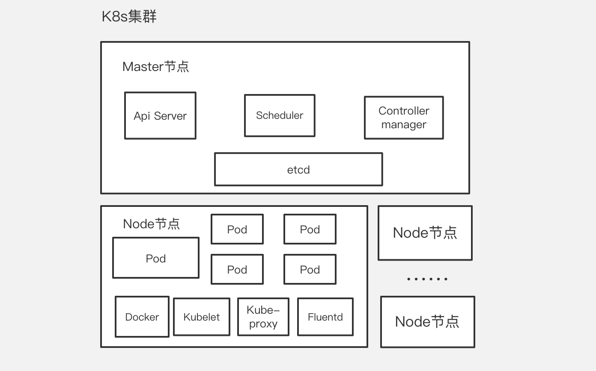

# Kubernetes 组件介绍

### Kubernetes学习相关文档

- [kubernetes英文官方文档](https://kubernetes.io/docs/tutorials/kubernetes-basics/)
- [Kubernetes中文社区 | 中文文档](http://docs.kubernetes.org.cn/)

### Master 组件

Master组件提供集群的管理控制中心。

Master组件可以在集群中任何节点上运行。但是为了简单起见，通常在一台VM/机器上启动所有Master组件，并且不会在此VM/机器上运行用户容器。

- #### kube-apiserver

  [kube-apiserver](https://kubernetes.io/docs/admin/kube-apiserver)用于暴露Kubernetes API。任何的资源请求/调用操作都是通过kube-apiserver提供的接口进行。

  

- #### kube-scheduler

  kube-scheduler 监视新创建没有分配到[Node](http://docs.kubernetes.org.cn/304.html)的[Pod](http://docs.kubernetes.org.cn/312.html)，为Pod选择一个Node。

  

- #### kube-controller-manager

  [kube-controller-manager](https://kubernetes.io/docs/admin/kube-controller-manager)运行管理控制器，它们是集群中处理常规任务的后台线程。逻辑上，每个控制器是一个单独的进程，但为了降低复杂性，它们都被编译成单个二进制文件，并在单个进程中运行。

  这些控制器包括：

  - [节点（Node）控制器](http://docs.kubernetes.org.cn/304.html)。
  - 副本（Replication）控制器：负责维护系统中每个副本中的pod。
  - 端点（Endpoints）控制器：填充Endpoints对象（即连接Services＆Pods）。
  - [Service Account](http://docs.kubernetes.org.cn/84.html)和Token控制器：为新的[Namespace](http://docs.kubernetes.org.cn/242.html) 创建默认帐户访问API Token。

  

- #### ETCD

  [etcd](https://kubernetes.io/docs/admin/etcd)是Kubernetes提供默认的存储系统，保存所有集群数据，使用时需要为etcd数据提供备份计划。

  

- #### DNS

  - 虽然不严格要求使用插件，但Kubernetes集群都应该具有集群 DNS。
  - 群集 DNS是一个DNS服务器，能够为 Kubernetes services提供 DNS记录。
  - 由Kubernetes启动的容器自动将这个DNS服务器包含在他们的DNS searches中。

  

- #### cloud-controller-manager

- #### 插件 addons

- #### 用户界面

- #### 容器资源监测

- #### Cluster-level Logging

### 节点（Node）组件

- #### Pod

  [Pod](http://docs.kubernetes.org.cn/312.html)是Kubernetes创建或部署的最小/最简单的基本单位，一个Pod代表集群上正在运行的一个进程。

  - 一个Pod封装一个应用容器（也可以有多个容器），存储资源、一个独立的网络IP以及管理控制容器运行方式的策略选项。
  - Pod代表部署的一个单位：Kubernetes中单个应用的实例，它可能由单个容器或多个容器共享组成的资源。

  

- #### kubelet

  [kubelet](https://kubernetes.io/docs/admin/kubelet)是主要的节点代理，它会监视已分配给节点的pod，具体功能：

  - 安装Pod所需的volume。
  - 下载Pod的Secrets。
  - Pod中运行的 docker（或experimentally，rkt）容器。
  - 定期执行容器健康检查。
  - 通过创建镜像pod，将pod的状态报告回系统的其余部分。
  - 将节点的状态报告回系统的其他部分。

  

- #### kube-proxy

  [kube-proxy](https://kubernetes.io/docs/admin/kube-proxy)通过在主机上维护网络规则并执行连接转发来实现Kubernetes服务抽象。

  

- #### docker

  docker用于运行容器。

  

- #### fluentd

  fluentd是一个守护进程。

  两个用途：

  - 1.以日志收集中转中心角色拉起，Deployment部署模式；
  - 2.在部分Fluent Bit无法正常运行的主机上，以Daemon Set模式运行采集宿主机上的日志，并发送给日志收集中转中心

  

- #### RKT

- #### supervisord

