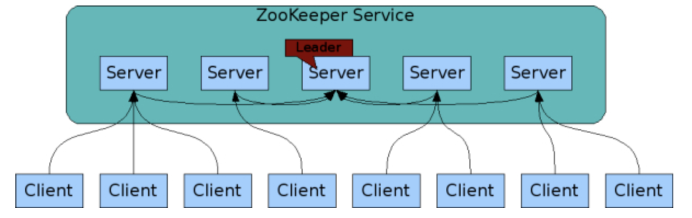
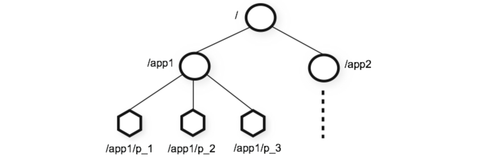
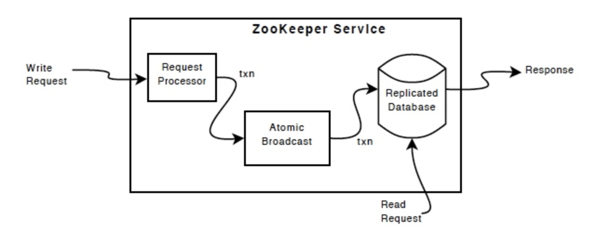

# ZooKeeper 概览 --官方文档

### ZooKeeper: A Distributed Coordination Service for Distributed Applications

zookeeper是一个开源的分布式协调服务，用于分布式程序。它公开了一组简单的函数，分布式应用程序可以利用这些函数来实现更高级别的服务，以实现同步，配置维护以及组和命名。zookeeper易于编程，并且数据模型使用类似于我们熟悉的标准文件系统的目录结构。可以运行在java，并且绑定了java和c。

众所周知，协调服务很难做到正确。它们特别容易出现诸如竞态条件和死锁等错误。ZooKeeper背后的动机是减轻分布式应用程序从头开始实施协调服务的责任。

### Design Goals

**ZooKeeper is simple.**ZooKeeper允许分布式进程通过与标准文件系统组织相似的共享的分层的命名称空间相互协调。命名空间由数据寄存器组成，在zookeeper中成为znode，与文件和目录类似。与典型文件系统不同的是，他专为存储而设计的，ZooKeeper数据保存在内存中，这意味着ZooKeeper可以实现高吞吐量和低延迟数量。

zookeeper实现了高性能，高可用性，严格的顺序访问。zookeeper在性能方面，可以用于大型分布式系统。在可靠性方面他避免了单点故障。严格的顺序访问意味着可以在客户端可以实现复杂的同步。

**ZooKeeper is replicated.**就像它所协调的分布式程序一样，ZooKeeper本身旨在在一组主机上进行复制。

组成zookeeper服务的服务器必须相互知道了解。它们保持状态（stat）的内存映像，以及持久存储中的事务日志和快照。只要zookeeper服务器大部分可用mzookeeper服务就可用。

客户端链接到伊塔zoopeeper服务器，客户端维护一个TCP连接，通过它发送请求，获取响应，获取watch时间并发送心跳。如果链接服务器的TCP连接中断，客户端连接到不同的服务器。

**ZooKeeper is ordered.** zookeeper用数字标记每一个更新，他放映所有zookeeper事务的顺序。后续操作可以使用该顺序是想更高级别的抽象，例如同步图元。

**ZooKeeper is fast.**它在以读取为主的工作中速度特别快，zooleepr在数千的机器上运行，在读取比写入更为普遍的情况下，它的性能表现最佳，比例约为10：1。

### Data model and the hierarchical namespace

zookeeper提供的命名空间非常想标准的文件系统，名称是有一系列/分隔的路径元素。zookeeper命名空间中的每一个节点都由一个路径标识。

*ZooKeeper’s Hierarchical Namespace*

### Nodes and ephemeral nodes

与标准文件系统不同的是，ZooKeeper命名空间中的每个节点都可以拥有与其相关的数据以及子级。这就像有一个文件系统，允许一个文件也是一个目录。(zookeepr设计用于存储协调数据：状态信息，配置，位置信息等，因此存储在每个节点上的数据通常很小，在字节到千字节之间。)，我们使用术语来说明正在谈论zookeeper数据节点。znode维护一个包含数据更改版本号，ACL变化，以及时间戳的统计结构，以允许缓存验证和协调更新。每次znode的数据发生变化时，版本号会增加，例如，每当客户端检索数据时，也会收到数据的版本。

存储在命名空间上的数据节点的数据都是以原子的方式读取和写入的，读取获得znode所有相关的数据字节，写入将替换所有数据。每个znode都有一个访问控制列表（ACL），限制谁可以做什么操作。

zookeeper也有临时几点的概念，只要创建znode的会话处于活动状态，就会存在这些znode。当会话结束，znode被删除。当你想实现[tbd]时，临时节点很有用。

### Conditional updates and watches

zookeeper支持监视的概念，客户端在znode上设置一个watch，当znode发生变化的时候，watch会被触发并删除，当一个watch触发时，客户端会收到一个告知znode发生变化的包，如果客户端和其中一个Zoo Keeper服务器之间的连接断开，客户端将收到本地通知。这些可用于[tbd]。

### Guarantees

zookeeper 非常快速且非常简单，他的目标是构建更复杂的基础服务，如同步，它提供了一系列的保证，如下所示：

- 顺序一致性（Sequential Consistency）- 来自客户端的更新，将按照他们发送的顺序进行应用。
- 原子性（Atomicity）-更新成功或者失败，没有中间结果。
- 单系统镜像（Single System Image）-无论连接的哪个服务器，客户端均会看到相同的服务视图。
- 可靠性（Reliability ）-一旦应用了更新操作，更新将持续到客户端覆盖更新为止。
- Timeliness -系统的客户视图保证在一定的时间范围内保持最新状态

### Simple API

zookeeper设计目标之一就是提供简单的编程接口，因此，它仅支持这些操作：

**create**
creates a node at a location in the tree

**delete**
deletes a node

**exists**
tests if a node exists at a location

**get data**
reads the data from a node

**set data**
writes data to a node

**get children**
retrieves a list of children of a node

**sync**
waits for data to be propagated

有关这些更深入的讨论，以及如何使用它们来实施更高级别的操作，请参阅[tbd]

### Implementation

ZooKeeper组件显示了ZooKeeper服务的高级组件。除请求处理器外，构成ZooKeeper服务的每个服务器都复制其各个组件的副本。

*ZooKeeper Components*

Replicated database 是一个包含整个数据树的内存数据库，将更新日志存储在磁盘议事项可恢复，并且在应用到内存数据库之前写入操作序列化到磁盘。

每个ZooKeeper服务器都为客户提供服务。客户端连接一个服务器提交request，读取request的服务由每个服务器数据库的本地副本提供。通过协定的协议处理更改服务状态、写入请求的请求。

作为协定协议的一部分，来自客户端的所有写入请求都被转发到叫做leader的单个服务器，其他的服务器被称为follower，接收来自leader的消息建议并同意消息传递。消息传递层负责替换失败的领导者，并同步leader和follower。

ZooKeeper使用自定义的原子消息传递协议。zookeeper使用自定义的原子消息协议传递协议。由于消息传递层是原子的，因此ZooKeeper可以保证本地副本永不分歧。当leader接收到写请求，当写入被应用并且将其转换为捕获这个新状态的事务时，它计算系统状态是何时更改的。

### Uses

ZooKeeper的编程接口是有意简单的，但是，有了它，您可以实现更高阶的操作，例如同步原语，组成员资格，所有权等。一些分布式应用程序已将其用于[tbd: add uses from white paper and video presentation.] For more information, see [tbd]

### Performance

### Reliability

### The ZooKeeper Project

